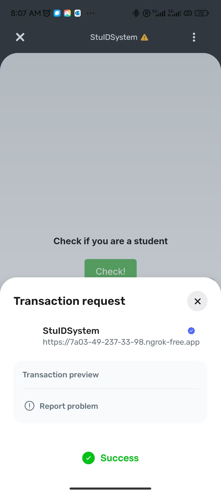
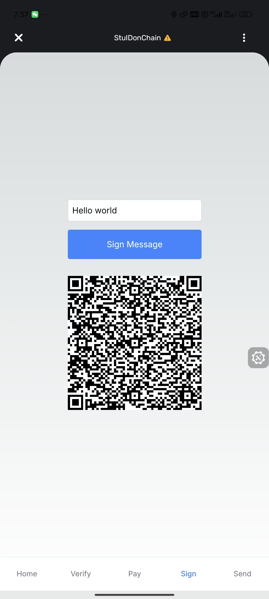

# (What We Hoped to Create) Digital Student ID Based on World

## Background  
Xiao Ming, a university student, loves coding—especially with the help of GitHub Copilot. However, his family isn't well-off, so he applied for GitHub's student benefits.  
His journey was far from smooth. Not only did he have to spend considerable time and effort obtaining proof of enrollment, but he also anxiously awaited approval from the staff.  
After much struggle, Xiao Ming finally gained free access to Copilot. But the painful experience left him sleepless, even triggering PTSD.  
Determined to change things, he eventually stumbled upon WorldCoin and their MiniApp.

## Requirements  
- Reliable verification  
- Privacy protection  
- Speed and convenience  
- Human-friendly experience  

## Features We (Hoped to) Implement  
- Maintain a student list on-chain, recording addresses and expiration dates.  
- Enable individual student verification through signatures.  
- Allow merchants to verify student status via smart contracts during transactions.  
- Incentivize students with tokens for completing academic, social, or support activities.  
- Facilitate token exchanges for goods or services within the school.  
- Build a community where tokens can be traded for tasks, mainly educational ones.  

## What Actually Happened?  
- Lightning-fast development of a highly robust smart contract.  
- Lost 40% of our time due to a UI bug in the Developer Portal.  
- Spent 50% of our time on the MiniApp demo.  
- One of the few meaningful features: signing arbitrary strings using WorldID.  
- Encountered a scam attempt while seeking help on Discord (but most people were kind and helpful!).  
- Couldn't help but laugh at the messy codebase.  
- Massive emotional damage.

## What Did We Learn?  
- Smart contract development  
- Front-end development  
- Maintaining a positive mindset  
- Stress management

    
     
    

      It seems that the authentication function has been implemented.
  	

    
     
    

      Signature: One of the few potentially meaningful features.
  	

